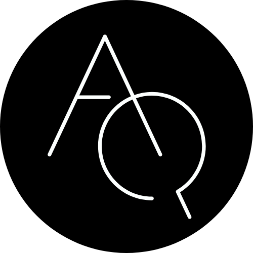
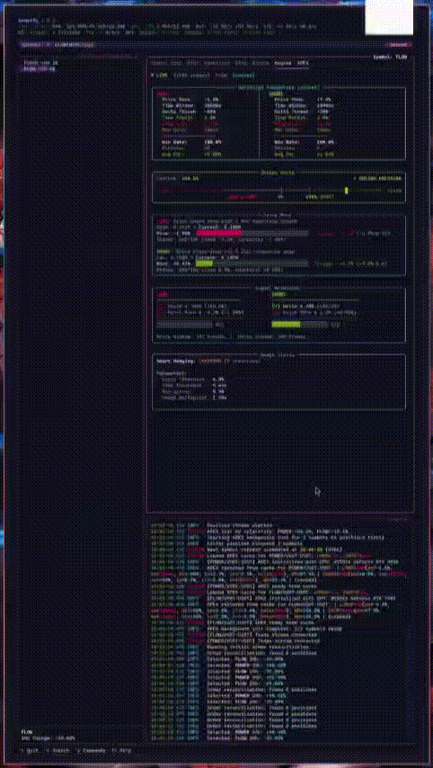

<p align="center">
  
</p>

# aequify-ml

OSS version of original aequify rewritten in Python + Mojo.

<p align="center">
  
</p>

## Supported Exchange

- Binance Futures USD-M

## APEX (Adaptive Parameter Exploration)

APEX is a GPU-accelerated parameter optimization engine for trading signals. It uses Mojo kernels to perform high-speed grid search over parameter combinations.

In other words, just a fancy backtester... at least for now.

**How it works:**

1. **Bootstrap** - Analyzes historical trade data to find optimal signal parameters via GPU grid search
   - Computes rolling high/low prices over configurable time windows
   - Calculates volume delta (buy/sell imbalance) over the same windows
   - Tests thousands of parameter combinations in parallel on GPU
   - Selects best parameters based on win rate and PnL

2. **Live Detection** - Real-time signal detection using bootstrapped parameters
   - Tracks rolling metrics from live trade stream
   - Emits LONG signals on price drops with selling pressure
   - Emits SHORT signals on price rises with buying pressure

## Configuration

Configuration is managed via `config/config.yaml`. Key sections:

- `trading` - Trading mode, position sizing, risk limits
- `filters` - Symbol filtering (whitelist/blacklist, price change filters)
- `engines.apex.bootstrap` - APEX parameter bounds and grid search settings
- `database` - QuestDB connection settings

**Per-symbol overrides** can be placed in `config/overrides/{SYMBOL}.yaml` to customize parameter bounds for specific trading pairs. These are auto-generated after bootstrap with narrowed bounds based on good-performing combinations.

## Installation

### Requirements

- [mise](https://mise.jdx.dev) - Runtime manager
- [uv](https://docs.astral.sh/uv/) - Python package manager (installed via mise)
- Python 3.14+
- QuestDB (auto-installed via mise tasks)

### Setup

```bash
# Install dependencies
mise install
mise run install

# Run with dev dependencies
mise run dev

# Run aequify
mise run aequify
```

### Available Tasks

Run `mise run` to see all available tasks.

### Hardware Requirements

**GPU:** NVIDIA GPUs supported and tested. AMD may work but untested. APEX bootstrap requires GPU for grid search acceleration.

## Contributing

Not accepting PRs at this time. Issues and feature requests welcome.

## Support

If you find this project useful, buy me a cigarette

<p align="center">
  
</p>
